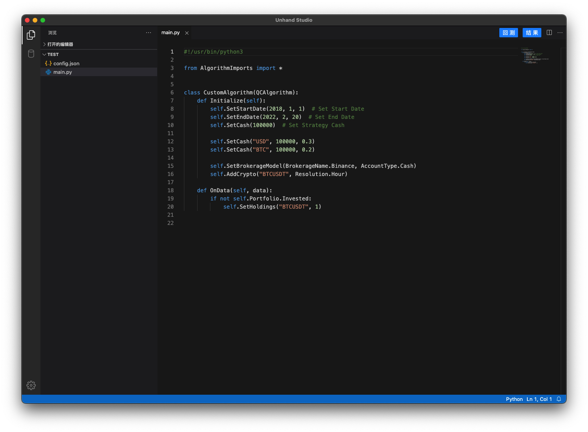

# Unhand Studio

A quantization algorithm editor

# Requires

## Windows

```shell
# Installing WSL GuestOS on PowerShell
wsl --install -d Ubuntu-20.04

# Set user and password
# Keep up to date
wsl -d Ubuntu-20.04
sudo apt update && sudo apt upgrade -y

# Add distrod to the GuestOS
curl -L -O "https://raw.githubusercontent.com/nullpo-head/wsl-distrod/main/install.sh"
sudo chmod +x install.sh
sudo ./install.sh install

# Enable systemd
sudo /opt/distrod/bin/distrod enable
# Enable systemd and let it start as Windows starts
sudo /opt/distrod/bin/distrod enable --start-on-windows-boot

# Restart WSL
exit
wsl -t Ubuntu-20.04
wsl -d Ubuntu-20.04
pgrep system -a

# Install additional required packages
sudo apt install -y uidmap fuse-overlayfs

# Allow systemctl to run as rootless and put it in runtime path
sudo loginctl enable-linger $(id -un)
ls /run/user/$(id -u)
export XDG_RUNTIME_DIR=/run/user/$(id -u)

# Install Nerdctl and Containerd
cd ~/
mkdir .local
cd .local/
wget https://github.com/containerd/nerdctl/releases/download/v0.15.0/nerdctl-full-0.15.0-linux-amd64.tar.gz
tar xfz nerdctl-full-0.15.0-linux-amd64.tar.gz
cd ~/
# Run the installer through the path of the bin directory
export PATH=$HOME/.local/bin:$PATH
containerd-rootless-setuptool.sh install
pgrep contain -a
```

## Preview




